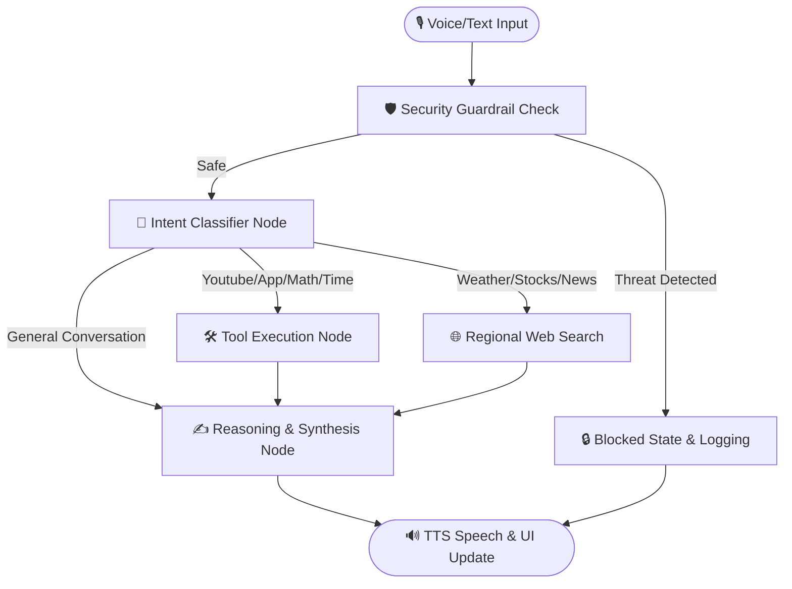

# 🎙️ Action Assistant (Desktop AI Voice Assistant)

A powerful, high-performance desktop voice assistant for Windows. It combines local LLM reasoning (via Ollama and LangGraph) with real-time speech processing (Faster-Whisper and Edge-TTS), Windows system integration (PyCaw audio ducking, app launcher), and smart safety guardrails.

---

## 🌟 Key Features

* **🧠 LangGraph State Machine Routing:** Uses structured state orchestration to route user queries through validation, intent classification, local tools, live web queries, and final prompt synthesis.
* **⚡ Local LLM Execution:** Leverages Ollama (defaulting to `llama3.2:3b`) for private, offline reasoning and natural conversation.
* **🎙️ Faster-Whisper Speech Recognition (STT):** Uses a local `small` Whisper model running with CUDA acceleration (`float16`) for near-instant, high-accuracy speech transcription.
* **🔊 Natural Text-to-Speech (TTS):** Generates clear, expressive voices using Microsoft’s `edge-tts` (configured with `en-IN-NeerjaNeural` Indian English voice).
* **🎛️ Dual-Phase Audio Ducking:** Uses Windows Core Audio APIs (`pycaw`) to automatically lower system/speaker volume while the microphone is listening (to 10%) and when the assistant is speaking (to 20%), preventing feedback loops.
* **📂 Local Knowledge Base RAG:** Indexes documents from a local knowledge folder into a Chroma vector database using `all-MiniLM-L6-v2` embeddings, utilizing threshold-based Direct and Did-You-Mean (DYM) query matching.
* **🛠️ Advanced Desktop Tools:**
  * **App Launcher:** Direct mapping to open programs like Chrome, VS Code, Spotify, Notepad, Paint, and VLC.
  * **YouTube Autoplay:** Plays music and videos automatically on YouTube via `pywhatkit`.
  * **Math Solver:** Safely evaluates mathematical expressions and powers.
  * **Live Web Search:** Performs real-time search queries utilizing DuckDuckGo (`ddgs`) prioritizing Indian/regional info.
* **🛡️ Security & Mental Health Guardrails:**
  * **Audit Log:** Automatically records all system events and query categories.
  * **Sanitization:** Sanitizes queries to prevent terminal injection.
  * **Tele-MANAS Support:** Detects crisis/mental health phrases and immediately presents the Tele-MANAS helpline card (`14416`) with supportive prompts.

---

## 📐 System Architecture

The workflow is orchestrated using LangGraph to guarantee strict execution stages and safety checks:



---

## 📋 Prerequisites

* **Operating System:** Windows 10/11 (required for PyCaw and PowerPoint/MediaPlayer PowerShell integrations).
* **Python:** Python 3.10 - 3.12 (standard virtual environment).
* **Ollama:** Installed and running locally.
  * Pull the model: `ollama pull llama3.2:3b`
* **CUDA Support (Optional but highly recommended):** For GPU-accelerated Faster-Whisper.
  * Install [NVIDIA CUDA Toolkit](https://developer.nvidia.com/cuda-downloads) and [cuDNN](https://developer.nvidia.com/cudnn).

---

## 🔧 Installation & Setup

1. **Clone the repository:**
   ```bash
   git clone https://github.com/Akshad-Morghade/desktop-ai-assistant.git
   cd desktop-ai-assistant
   ```

2. **Set up a Virtual Environment:**
   ```powershell
   python -m venv venv
   .\venv\Scripts\activate
   ```

3. **Install Dependencies:**
   ```powershell
   pip install -r requirements.txt
   ```

4. **Verify PyAudio & PyCaw Requirements:**
   If you encounter issues installing `pyaudio`, you can install it using pre-compiled wheels:
   ```powershell
   pip install pipwin
   pipwin install pyaudio
   ```

---

## ⚙️ Configuration (`config.py`)

You can customize the assistant's behavior directly inside `config.py`:

* **Whisper Settings:** Set `WHISPER_DEVICE = "cuda"` for GPU execution or `"cpu"` if you do not have a dedicated NVIDIA GPU.
* **Application Paths:** Update `APP_MAP` to point to the exact file paths of executable programs on your machine (e.g., VS Code, Chrome, or Spotify).
* **TTS Voice:** Change `TTS_VOICE` to any supported Microsoft Edge TTS voice model.

---

## 🚀 Running the Assistant

1. Ensure Ollama is running locally:
   ```bash
   ollama run llama3.2:3b
   ```

2. Start the Action Assistant UI:
   ```powershell
   python main.py
   ```

3. **How to use:**
   * **Text Input:** Type your request in the message box at the bottom and press **Enter**.
   * **Voice Input:** Hold down the **Voice** button to record your request, then release it to transcribe and run the query.
   * **Rebuild KB:** Click the Rebuild KB option in the UI to refresh the vector indices from your local knowledge directory.

---

## 📁 Repository Structure

```
├── main.py               # Main entry point (starts UI & audio streams)
├── ui.py                 # Tkinter graphical user interface
├── brain.py              # LangGraph state machine & reasoning logic
├── tools.py              # Windows integrations & web tools
├── config.py             # System variables, paths, and application map
├── security.py           # Sanitization engine & Tele-MANAS routing
├── knowledge.py          # Local document embedding & RAG logic
├── requirements.txt      # Python packages list
└── .gitignore            # Git exclusion rules
```
